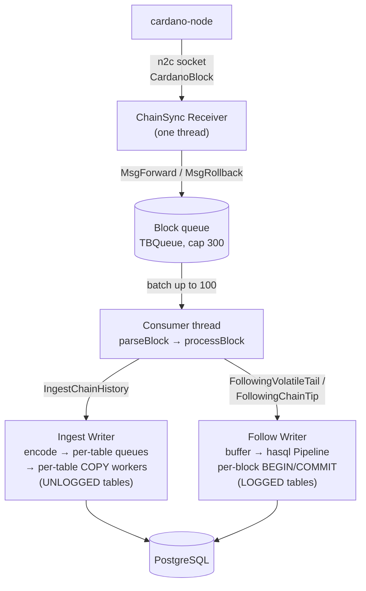

# dbsync

[](https://github.com/input-output-hk/dbsync/actions/workflows/docs.yml)
[](https://www.haskell.org/ghc/)
[](https://www.haskell.org/cabal/)
[](#license)


``` bash
/██████████///███████████///█████████//█████/█████/██████///█████///█████████/
░░███░░░░███/░░███░░░░░███/███░░░░░███░░███/░░███/░░██████/░░███///███░░░░░███
/░███///░░███/░███////░███░███////░░░//░░███/███///░███░███/░███//███/////░░░/
/░███////░███/░██████████/░░█████████///░░█████////░███░░███░███/░███/////////
/░███////░███/░███░░░░░███/░░░░░░░░███///░░███/////░███/░░██████/░███/////////
/░███////███//░███////░███/███////░███////░███/////░███//░░█████/░░███/////███
/██████████///███████████/░░█████████/////█████////█████//░░█████/░░█████████/
░░░░░░░░░░///░░░░░░░░░░░///░░░░░░░░░/////░░░░░////░░░░░////░░░░░///░░░░░░░░░//
```

A fast, modular indexer for the Cardano blockchain. dbsync follows a Cardano
node and projects on-chain data into a PostgreSQL schema you control table by
table via **profiles**.

Byron through Conway, governance included: **16 independent projections across
71 tables**, and you enable only the ones your queries need.

## Why dbsync

- **Profiles, not all-or-nothing.** Disabling a projection skips the parsing
  work *and* the tables it would own. A wallet backend does not pay for governance rows, an NFT explorer does not pay for stake distribution.
- **A bulk loader, not a row-at-a-time writer.** Chain history is ingested
  through parallel `COPY` streams into `UNLOGGED` tables with pre-assigned ids, then flipped to `LOGGED` and indexed in one preparing pass.
- **Schema upgrades migrate in place.** A new dbsync version brings a behind
  database forward at boot instead of demanding a re-sync. A database built by a newer binary, or one whose shape drifted, refuses to start.
- **Ledger state is optional.** Turn it on for rewards, per-epoch stake
  distribution and ADA pots; leave it off and everything block-derived still lands.
- **Checkable against the original.** The repo ships `dbsync-compare`, which
  diffs this database against an original cardano-db-sync one table by table and row by row.

## Performance

Genesis to mainnet tip in **~9 hours**.

| | |
|---|---|
| Target hardware | 4 cores / 16 GB RAM (disk speed matters more than CPU) |
| Ingest throughput | 100–500 blocks/s early Byron · 30–80 late Alonzo/Babbage · 10–30 late Conway |

Bigger machines sync faster, but the architecture does not need them. See [Troubleshooting](https://input-output-hk.github.io/dbsync/users/operations/troubleshooting) if you are below these numbers.

## Profiles

Six ready-to-run configs ship in [`config-examples/`](config-examples). Pick on what you will query, not on what looks comprehensive — it is the single biggest lever on both sync time and disk.

| Preset | Who it's for | Ledger | Size (mainnet) |
|---|---|---|---|
| `minimal` | Hash-to-height resolution, per-block summaries, verifying your stack end to end | off | ~30 GB |
| `utxo-only` | Wallet backends — address to UTxO set, balances, spend-tracing | off | ~160 GB |
| `spo` | Pool dashboards — registrations, delegation history, retirement schedule | off | ~185 GB |
| `dapp` | NFT / token explorers, on-chain metadata, Plutus contract analytics | off | ~265 GB |
| `everything-no-ledger` | Block explorers wanting the full on-chain schema without reward data | off | ~475 GB |
| `everything` | The full upstream-equivalent schema, rewards and stake distribution included | on | ~480 GB |

The `everything` figure is measured at mainnet tip; the rest are derived from its per-table breakdown. Allow 50% headroom.

> **The `cbor` tax.** `tx_cbor` (raw transaction bytes) is ~218 GB on its own nearly half of an `everything` database. If your consumers never re-serialise transactions, copy a preset and set `"cbor": false`: ~475 GB becomes ~260 GB.


## How it works

Four logical stages plus a phase-specific writer that swaps between bulk-load
and chain-tip following. The COPY path drives the catch-up; the hasql path
drives steady state.



The shape is identical across the run; only the writer changes between phases,
along with how row IDs are obtained. Deep dive:
[Architecture](https://input-output-hk.github.io/dbsync/developers/architecture).

## Quick start

### Docker images (planed)

There will be docker images provided as well as ledger/db snapshots that can be used with *fast onboarding* (see bellow).

### Manually 

You'll need PostgreSQL ≥ 16 and a running `cardano-node`. See the [user docs](https://input-output-hk.github.io/dbsync/users/intro) for the full setup and prerequisites by platform.

Requires **GHC 9.14.1** and **cabal-install 3.16.1.0** — install both via [ghcup](https://www.haskell.org/ghcup/). Other combinations may fail to solve against the pinned `index-state`.

```bash
git clone https://github.com/input-output-hk/dbsync.git
cd dbsync
cabal build all
```
Then point it at a running node and an empty database:

```bash
dbsync \
  --config           ./config-examples/dapp.json \
  --pg-config        ~/cardano/pg-config.json \
  --node-config      ~/cardano/mainnet/config.json \
  --socket-path      ~/cardano/mainnet/db/node.socket \
  --ledger-state-dir ~/cardano/mainnet
```

## Planned: fast onboarding

Operators standing up a fresh instance would rather restore a prebuilt database than sync from genesis. The obstacle has never been hosting a dump — it is that
nothing verifies one. Eg: editing a single unspent output in a real mainnet snapshot, recomputed the checksum, and every existing check passed.

The way out is that **the snapshot never has to be trusted — only checked.**
Anyone running dbsync already runs a Mithril-certified node, and nearly
everything dbsync stores is derived from transaction bodies, so it can be
re-derived from the operator's own trusted blocks and compared. Three layers,
each usable on its own:

- **Provenance** — an Ed25519 signature over a manifest of per-file hashes.
  Catches a substituted archive or a mirror serving something else. Note that
  the tamper above passes this layer by construction, which is why signatures
  alone are not the answer.
- **Consistency** — recomputes stored aggregates from the rows they summarise,
  in SQL. Needs nothing but the restored database: no node, no network. This is
  the pragmatic default, and it catches the demonstrated attack.
- **Re-derivation** — re-reads blocks from your own node and compares row by
  row. Costs one chain pass, and is the complete answer for anyone whose data
  has to be right.

## Documentation

| | |
|---|---|
| **[User documentation](https://input-output-hk.github.io/dbsync/users/intro)** | Install, configure, run, and operate dbsync. |
| **[Preset configs](https://input-output-hk.github.io/dbsync/users/profiles/presets)** | What each profile contains and who it suits. |
| **[Running dbsync](https://input-output-hk.github.io/dbsync/users/running)** | CLI flags, credentials, first-run expectations. |
| **[Developer documentation](https://input-output-hk.github.io/dbsync/developers/intro)** | Architecture, extractors, contribution guide. |
| **[Extractor reference](https://input-output-hk.github.io/dbsync/developers/extractors/existing)** | Every projection and the tables it owns. |

## Repository layout

- `dbsync/` — the sync engine
- `dbsync-db/` — schema types, DDL, COPY encoders, hasql statements
- `dbsync-smash/` — SMASH stake-pool metadata server (stub)
- `tests/` — test suites, `dbsync-mock` (mock-chain forging), `dbsync-compare`
- `config-examples/` — preset config JSON files and a pg-config example
- `docs/` — Docusaurus source for the documentation site

## License

Apache-2.0, as declared in each package's `.cabal` file.
