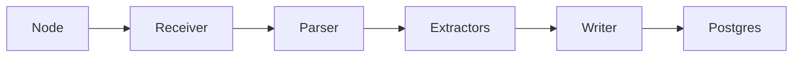

# dbsync documentation site

Docusaurus 3 site that builds the public docs at
`https://input-output-hk.github.io/dbsync/`.

## Local development

```bash
cd docs
npm ci
npm run start
```

Opens `http://localhost:3000` with hot reload.

## Build

```bash
npm run build      # produces docs/build/
npm run serve      # serves the built site locally
npm run typecheck  # type-checks docusaurus.config.ts and React components
```

## Structure

```
docs/
├── docusaurus.config.ts        # site config, plugins, theme
├── sidebars.users.ts           # left-nav for /users/*
├── sidebars.developers.ts      # left-nav for /developers/*
├── users/                      # Markdown for the Users section
├── developers/                 # Markdown for the Developers section
├── src/
│   ├── css/custom.css          # theme tokens
│   └── pages/index.tsx         # landing page
└── static/
    └── img/                    # logo, favicon, illustrations
```

## Adding a page

1. Create the Markdown file under `users/` or `developers/`.
2. Add front matter:
   ```yaml
   ---
   id: my-page
   title: My page
   sidebar_position: 5
   ---
   ```
3. Add the page ID to the matching `sidebars.*.ts` file.

## Mermaid diagrams

Mermaid is enabled. Use fenced code blocks:

````markdown

````

## Deployment

`main`-branch pushes trigger `.github/workflows/docs.yml`, which:

1. Installs Node 20 and project dependencies.
2. Type-checks the config and builds the static site.
3. Deploys to GitHub Pages via `actions/deploy-pages`.

PRs run the build (typecheck + build) without deploying.
