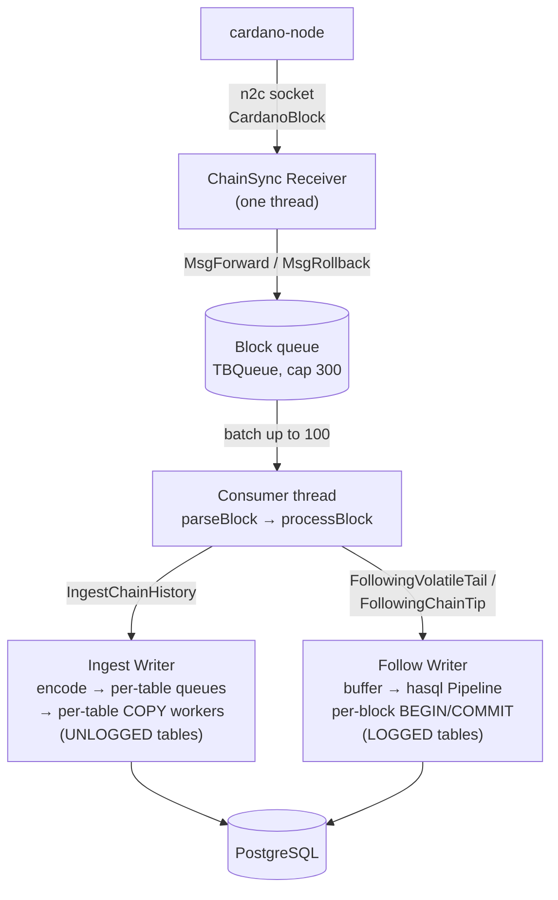
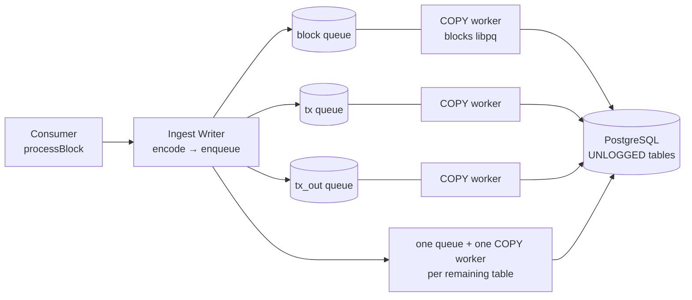
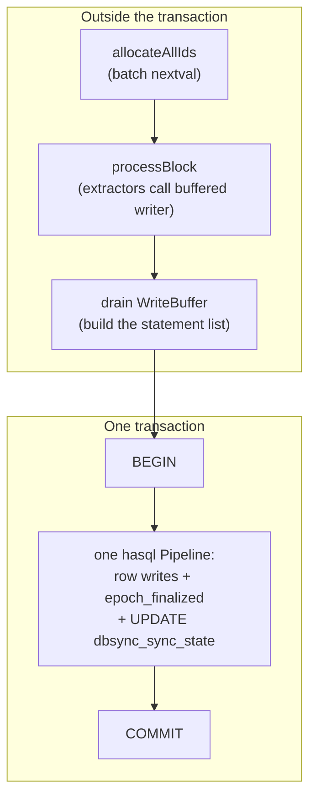

# Architecture

dbsync follows a running Cardano node over a node-to-client (n2c) Unix socket
and writes on-chain data into a PostgreSQL schema you control table by table
through the config's `extractors` block.

This page covers the end-to-end data flow. For the lifecycle around it — when
the pipeline catches up, when it switches modes, how it restarts — see
[Sync phases](phases/overview).

## The pipeline

The hot path has four logical stages. Only **one thread** runs the
parse-extract-write sequence; the receiver runs on its own thread and the
COPY writes fan out to a dedicated thread per table in the Ingest phase.

The writer at the end is what swaps between phases. Both write paths are in
play across the lifetime of a sync — the COPY path drives the bulk-load
catch-up, the hasql path drives steady-state chain following:



Each stage in brief:

| Stage | Module | Output |
|---|---|---|
| **Receiver** | `DbSync.ChainSync.Connection` | `ChainSyncMsg` (forward block or rollback marker). Also publishes the latest tip and observes `nodeTip − k`. |
| **Parser** | `DbSync.Parser.Dispatch` | Era-independent `GenericBlock` from ledger types. Per-era converters under `DbSync.Parser.*`. |
| **Extractors** | `DbSync.Extractor.*` | Typed rows for the tables each extractor owns. Driven by `processBlock`, which pre-assigns shared IDs before any extractor runs. |
| **Writer** | `DbSync.Phase.{Ingest,Following}.Writer` | Rows reach PostgreSQL. Implementation swaps by phase; deep dives in [Ingest fan-out](#ingest-write-fan-out) and [Follow batching](#follow-write-batching). |

The parser and the extractors run on the **consumer thread**. They are not
separate stages with their own queues. The inter-thread hops on the hot path
are:

1. Receiver → consumer, over the block queue.
2. Consumer → COPY workers, over the per-table queues. Ingest only.
3. Ledger worker → consumer, when `ledger.enabled = true`. This one
   **blocks**: `takeBlockLedgerData` waits on the worker's per-block result
   before the extractors run.

## Generic block representation

`DbSync.Parser.Types.GenericBlock` is the era-independent shape extractors
consume. Era-specific layouts collapse at parse time so extractors don't
have to. `GenericTx` is intentionally close to a 1:1 mapping with the `tx`
table, and `CertAction` covers every certificate kind across every era —
extractors dispatch on the constructor without re-deserialising CBOR.

## Pre-assigned shared IDs

Before any extractor runs, `processBlock` ([`DbSync.Extractor.Pipeline`](https://github.com/input-output-hk/dbsync/blob/main/dbsync/src/DbSync/Extractor/Pipeline.hs))
resolves the slot leader, assigns the new `BlockId`, and assigns `TxId` /
`TxOutId` for every tx and output in the block. It packages them into a
`BlockContext` and hands it to each extractor in turn.

This is why extractors are textually independent — they consume the
pre-assigned IDs without sequencing between themselves.

## The extractor model

An extractor is a `DbSync.Extractor.ExtractorDef` — a record carrying a
name, the table definitions it owns, and a process function:

```haskell
type ProcessBlockFn =
  forall env m.
  ( HasResolver env, HasWriter env, HasNetwork env
  , MonadReader env m, MonadIO m
  )
  => BlockContext -> m ()
```

The polymorphism over `env` is what lets the *same* extractor body run in
**both** Ingest and Follow. The phase decides which `Resolver` and `Writer`
the env carries; the extractor doesn't need to know which.

The wired extractors live under `DbSync.Extractor.*`. The single source of
truth for which exist is `DbSync.Extractor.Registry.allKnownExtractors`;
`DbSync.App.Setup.buildExtractors` only resolves config keys against it. For
the contract in full, see
[Extractor anatomy](extractors/anatomy); for what each one writes, see
[Existing extractors](extractors/existing).

## Cross-phase interfaces

Two interfaces let one extractor body work in both phases:

- **`IdResolver`** ([`DbSync.Resolver`](https://github.com/input-output-hk/dbsync/blob/main/dbsync/src/DbSync/Resolver.hs)) —
  40 fields for ID assignment, lookup-or-insert, and UTxO operations.
  Two implementations: the Ingest one is backed by an in-process counter
  plus LSM-tree dedup stores; the Follow one is backed by PostgreSQL
  sequences plus `SELECT … WHERE hash = ?`.
- **`Writer`** ([`DbSync.Writer`](https://github.com/input-output-hk/dbsync/blob/main/dbsync/src/DbSync/Writer.hs)) —
  one `write*` function per table plus `commit`. The Ingest implementation
  encodes rows to **COPY text** and pushes them into `LoaderStream`; the
  Follow implementation buffers writes per block and drains as a single
  hasql `Pipeline` inside `BEGIN`/`COMMIT`.

## Phase writers

The pipeline shape is identical across phases. What swaps is the **Writer**,
and with it the strategy for obtaining row IDs.

| Phase | Writer | ID strategy | Commit cadence |
|---|---|---|---|
| `IngestChainHistory` | `LoaderStream` (one COPY thread per table) into UNLOGGED tables | Pre-assigned via DedupStore + Counter | Per epoch boundary |
| `PreparingForVolatileTail` | One hasql connection, parallel pool for heavy work | n/a (DDL only) | Per step, via each statement's implicit transaction |
| `FollowingVolatileTail` / `FollowingChainTip` | One hasql connection, buffered writes flushed as a `Pipeline` per block | Batch `nextval` over `generate_series`; `SELECT` for existing parents | Per block |

Prep has **no** enclosing transaction. Each step runs in its own implicit
one, so a crash resumes at the step boundary rather than rolling the whole
pass back.

`PreparingForVolatileTail` is the one-time bridge between the two write
paths: it builds indexes, flips tables UNLOGGED → LOGGED, backfills FK
columns (`tx_in.tx_out_id`, `tx_out.consumed_by_tx_id`), and runs
`ANALYZE`. See [PreparingForVolatileTail](phases/preparing) for the
sequence.

## Storage backends

dbsync uses two persistent backends side by side:

- **PostgreSQL** is the destination — what users query. Every extractor
  ultimately writes here via the phase Writer.
- **LSM-tree** ([`lsm-tree`](https://hackage.haskell.org/package/lsm-tree),
  with `blockio` + `fs-api`) is the local, in-process backend for
  write-heavy persistent dictionaries.

Three pieces sit on LSM:

| Store | Module root | Used by |
|---|---|---|
| **Ingest dedup stores** | `DbSync.Phase.Ingest.DedupStore` | Ten natural-key → assigned-ID maps: pool hash, stake address, slot leader, multi-asset, script hash, datum, redeemer data, DRep hash, committee hash, voting anchor. Lets the Ingest COPY path produce stable IDs without round-tripping PG. Cost models are **not** here — they use a separate PG-backed cache on `ExtractState`. |
| **Ingest UTxO scratch** | `DbSync.Phase.Ingest.UtxoStore` | `tx-hash → (TxId, outputs)` for inline input resolution during COPY. Tracks the live UTxO set, not chain history — consumed outputs are deleted. |
| **Cardano LedgerDB** | `ouroboros-consensus:lsm` | The V2 LedgerDB the ledger worker drives. Keeps the on-disk UTxO set with in-memory caches and persists snapshots. |

The Ingest dedup and UTxO stores share a single `LsmSession`
([`DbSync.Phase.Ingest.LsmSession`](https://github.com/input-output-hk/dbsync/blob/main/dbsync/src/DbSync/Phase/Ingest/LsmSession.hs)).
Every epoch boundary persists a cheap snapshot. A **full compaction —
snapshot plus reopen — runs every 20th boundary**, not every one.

The session lives under `<state-dir>/dbsync-ledger/ingest-lsm/`. Its
tables close at the Ingest → Prep handoff, but the session itself is
deleted only **after Prep completes**: Prep needs it as the restart
anchor. Follow never consults it.

The Cardano LedgerDB lives under `<state-dir>/dbsync-ledger/` proper and
survives across all phases (and across restarts) when ledger is enabled.

:::info Why LSM
LSM suits all three: each is a write-dominated key-value store with
bursty, append-mostly traffic on the hot path, and each tolerates
compaction being deferred to a periodic pass. A B-tree such as RocksDB
or LMDB optimises for read-mostly workloads that these paths do not
have.
:::

## Ingest write fan-out

`LoaderStream` opens **one libpq connection per table** and spawns a worker
thread for each. The writer encodes rows, accumulates them into chunks of
roughly 64 KB, and pushes each chunk onto that table's queue. The worker
thread blocks in `PQ.putCopyData` on its dedicated connection without
contending with the others.



:::note No `RETURNING` over COPY
COPY has no return channel for generated IDs. The Ingest resolver
covers that gap with the **DedupStore** (LSM-tree mapping a natural
key to a previously assigned ID) and **Counter** (a per-table
monotonic counter that hands out fresh IDs). IDs are pre-assigned
in `processBlock` before any writer sees the row.
:::

## Follow write batching

In Follow the writer is much simpler — one hasql connection, one block at
a time:



ID allocation, extraction, and buffer drain all run **outside** the
transaction. Only the write pipeline is inside it.

The buffered writer (`DbSync.Phase.Following.WriteBuffer`) accumulates the
`INSERT`s every extractor issues during the block. The transaction then
sends the row writes and the `last_committed_slot` advance as one atomic
`Pipeline`. A crash anywhere leaves the database at the previous
`last_committed_slot`, with no partial-block state.

## Side channels

Three subsystems run **alongside** the main pipeline rather than inside it.
None of them sit on the hot path; an idle or stalled side channel slows
nothing on the consumer thread.

| Channel | Module root | Role |
|---|---|---|
| **Ledger Worker** | `DbSync.Worker.Ledger.*` | Optional. When `ledger.enabled = true`, replays blocks through the on-disk LSM-backed `LedgerDB` to produce per-block ledger output: deposits, rewards, protocol params, ada_pots. Persists snapshots for restart. Survives across Ingest → Prep → Follow. |
| **OffChain Fetcher** | `DbSync.Worker.OffChain.*` | Background HTTP fetcher for pool and Conway vote metadata. Misses don't block ingest. |
| **TxOut Worker** | `DbSync.Worker.TxOut.*` | Drains per-epoch **address buffer** and **consumed-by buffer** at each Ingest epoch boundary. Owns its own PG connection. |

The ledger worker consumes its own copy of the block stream: the receiver
fans `MsgForward` to a second queue when the ledger is on. Its per-block
output reaches extractors as `BlockLedgerData` on the `BlockContext`.

It is not fully decoupled, on two counts. The consumer **blocks** waiting
for each block's result, and the worker does write to PG on its own control
connection — `markSnapshotComplete` after each snapshot, and
`writePendingRollbackSlot` on a deep rollback.

See [Workers](workers) for the per-worker breakdown.

## The application monad

Everything runs in `AppM env`, a `ReaderT env IO` newtype:

```haskell
newtype AppM env a = AppM { unAppM :: ReaderT env IO a }
  deriving newtype (Functor, Applicative, Monad, MonadIO, MonadReader env, MonadUnliftIO)
```

Phase-specific aliases — `CoreM`, `IngestM`, `FollowM`, `LedgerM` — name the
env each phase uses. Most modules carry `HasXxx`-constraint signatures
(`HasResolver env`, `HasWriter env`, `HasTracer env`, `HasHasqlConnection env`,
…) and work in any env that satisfies them. The instances connecting phase
envs to the classes live in `DbSync.App.Env` to break what would otherwise
be circular imports.

`MonadUnliftIO` means `bracket`, `withAsync`, `catch`, and friends work
without manual `runAppM` ceremony.

## Boot

`DbSync.App.Boot.decideBoot` is a **pure** classification of the observed
state — the `dbsync_sync_state` row plus the list of on-disk ledger
snapshots — into one of:

- **`BootFresh`** — a sync-state row with no committed progress; start
  `IngestChainHistory` from genesis. An *empty* database never reaches
  here: schema init creates the schema and seeds the row first.
- **`BootResume`** — partial Ingest; restart at the last committed epoch.
- **`BootFollowRestart`** — `sync_complete = true`; start directly in
  `FollowingVolatileTail`.

Mismatches (snapshots without PG state, ledger-enabled flip, fingerprint
drift, …) abort early with operator-facing recovery instructions via
`renderBootError`. The effectful resolve helpers turn the decision into
either an `IngestBootState` the orchestrator wires into the Ingest pipeline,
or run the Follow loop directly on a Follow restart.

Read [`DbSync.App.Run`](https://github.com/input-output-hk/dbsync/blob/main/dbsync/src/DbSync/App/Run.hs) for
the full orchestration — the comments there walk through every setup step
in order.

## Threading

Across the run, the relevant threads are:

- **Main / orchestrator** — runs setup, then blocks on the consumer or
  Follow loop.
- **ChainSync receiver** — one thread, decoded blocks → block queue.
- **Consumer / Follow loop** — one thread, drains the block queue.
- **COPY workers** — one thread per table during Ingest. Cancelled at the
  Ingest → Prep boundary; they do not exist in Follow.
- **Ledger worker + snapshot writer** — one each when ledger is enabled.
- **TxOut worker** — one thread during Ingest; flushes at epoch
  boundaries.
- **OffChain fetcher** — one thread, HTTP polling.
- **Gauge sampler** — periodic diagnostics at Debug level, every 5s.

All threads spawn via `withAsync` and `link` to a parent, so a crash in any
of them propagates cleanly. The orchestrator's shutdown bracket releases
resources in reverse-creation order.
