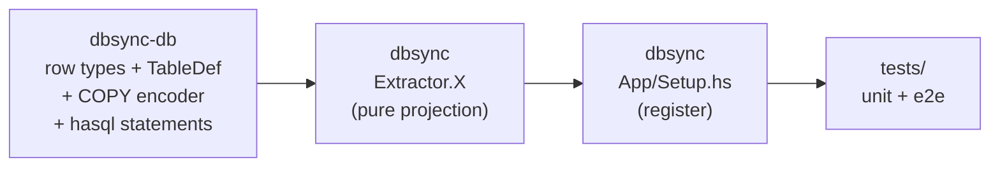

# Writing a new extractor

End-to-end walkthrough. Adding a new projection means landing changes
in three packages — schema in `dbsync-db`, processing in `dbsync`,
tests in `tests` — but the seam between them is narrow.

Read [Extractor anatomy](anatomy) first if you haven't.

## The shape of the work



Schema first, then the extractor body, then registration, then tests.
Nothing in the phase code, the resolver, or the writer needs to
change for a new projection: the `Writer` and `IdResolver` typeclasses
gain `write*` / `assign*` methods, and the existing Ingest and Follow
implementations grow to cover them.

## 1. Define the row types

Pick a domain module under `dbsync-db/src/DbSync/Db/Schema/`. For an
example, say you're adding a `claim` extractor that records on-chain
reward-claim events. Create `DbSync.Db.Schema.Claim`:

```haskell
data Claim = Claim
  { claimTxId       :: !TxId
  , claimSlotNo     :: !Word64
  , claimAddress    :: !ByteString
  , claimAmount     :: !DbLovelace
  }
  deriving stock (Eq, Show)
```

Plus a `claimTableDef :: TableDef` declaring columns, primary key,
table mode (`TableUnlogged` for an extractor-owned table), and any
unique constraints that should be indexed at Prep time. See
[Schema layer](../schema-layer) for the vocabulary.

Add a `ClaimId` newtype to `DbSync.Db.Schema.Ids` and the table to
the `dbsync_sync_state` per-table counter list (every table backed
by a per-table sequence needs a counter column).

## 2. Add the COPY encoder

In the same domain module, write `encodeClaimCopy :: ClaimId -> Claim -> ByteString`
that produces a single COPY-text row using the `Builder`-based
helpers in
[`DbSync.Db.Loader.Encoder`](https://github.com/input-output-hk/dbsync/blob/main/dbsync-db/src/DbSync/Db/Loader/Encoder.hs):

```haskell
encodeClaimCopy :: ClaimId -> Claim -> ByteString
encodeClaimCopy cId c = buildCopyRow
  [ Just (bInt64 (getClaimId cId))
  , Just (bInt64 (getTxId (claimTxId c)))
  , Just (bWord64 (claimSlotNo c))
  , Just (bHex (claimAddress c))
  , Just (bInt64 (fromIntegral (unDbLovelace (claimAmount c))))
  ]
```

`Nothing` produces a SQL `NULL`; the helpers do the COPY escaping.

## 3. Add a hasql statement for Follow

In `dbsync-db/src/DbSync/Db/Statement/Claim.hs`, add the per-row
insert and any lookups Follow needs:

```haskell
insertClaimRowStmt :: Stmt.Statement (ClaimId, Claim) ()
insertClaimRowStmt = ...
```

The Follow writer batches inserts through a hasql `Pipeline`, so the
statement just needs to be preparable; no per-call connection
gymnastics. See [`DbSync.Db.Statement.Block`](https://github.com/input-output-hk/dbsync/blob/main/dbsync-db/src/DbSync/Db/Statement/Block.hs)
for a representative shape.

If the extractor needs ID allocation in Follow (most do), add
`nextClaimIdStmt` using the
[`nextIdStmt`](https://github.com/input-output-hk/dbsync/blob/main/dbsync-db/src/DbSync/Db/Statement/Common.hs)
helper. The Follow `IdAllocator` will pre-allocate batches of these
at the start of every block.

## 4. Extend the Resolver and Writer

The `IdResolver` ([`DbSync.Resolver`](https://github.com/input-output-hk/dbsync/blob/main/dbsync/src/DbSync/Resolver.hs))
and `Writer` ([`DbSync.Writer`](https://github.com/input-output-hk/dbsync/blob/main/dbsync/src/DbSync/Writer.hs))
records gain one field each:

```haskell
-- Resolver
, assignClaimId :: !(m ClaimId)

-- Writer
, writeClaim :: !(ClaimId -> Claim -> m ())
```

Then update the four implementations:

- `Phase.Ingest.Resolver` — pull from the in-process counter.
- `Phase.Following.Resolver` — pull from the pre-allocated buffer.
- `Phase.Ingest.Writer.Claim` — new module; encodes via
  `encodeClaimCopy` and pushes to the `LoaderStream`.
- `Phase.Following.Writer.Claim` — new module; appends to the
  per-block `WriteBuffer` for flush via the hasql Pipeline.

The phase writer modules mirror each other directory-for-directory;
look at [`Phase.Ingest.Writer.Core`](https://github.com/input-output-hk/dbsync/blob/main/dbsync/src/DbSync/Phase/Ingest/Writer/Core.hs)
and [`Phase.Following.Writer.Core`](https://github.com/input-output-hk/dbsync/blob/main/dbsync/src/DbSync/Phase/Following/Writer/Core.hs)
together for the pattern.

Also extend `IdCounts` ([`DbSync.Phase.Following.IdCounts`](https://github.com/input-output-hk/dbsync/blob/main/dbsync/src/DbSync/Phase/Following/IdCounts.hs))
with a counter for `claim` so the Follow loop knows how many IDs to
allocate up front from `claim_id_seq`.

## 5. Write the extractor module

Create `DbSync.Extractor.Claim`:

```haskell
module DbSync.Extractor.Claim
  ( claimExtractor
  ) where

claimExtractor :: ExtractorDef
claimExtractor = ExtractorDef
  { pdName         = "claim"
  , pdVersion      = 1
  , pdDependencies = [("core", 1), ("stake_delegation", 1)]
  , pdTables       = [claimTableDef]
  , pdProcess      = processClaim
  }

processClaim :: ProcessBlockFn
processClaim ctx = do
  resolver <- asks getResolver
  writer   <- asks getWriter
  forM_ (bcTxs ctx) $ \tc -> do
    let txId = tcTxId tc
        gtx  = tcGenTx tc
    -- ... walk certs / withdrawals / outputs, build Claim rows,
    -- assign IDs via resolver, write via writer.
    forM_ (claimsIn gtx) $ \c -> do
      cId <- liftIO $ assignClaimId resolver
      liftIO $ writeClaim writer cId c
```

Keep the body small. Anything more complex than a few `forM_`s is
usually a sign that the pure
`GenericBlock → [Claim]` projection function should live in its own
helper and be tested separately.

## 6. Register the extractor

Two edits in
[`DbSync.App.Setup.buildExtractors`](https://github.com/input-output-hk/dbsync/blob/main/dbsync/src/DbSync/App/Setup.hs):

```haskell
resolveExtractor "claim" = claimExtractor
-- ...
optionalExtractors =
  [ ...
  , ("claim", prEnabled (pcClaim pc))
  ]
```

Then add `pcClaim :: !SyncOption` to `SyncOptions` in
[`DbSync.App.Config.Types`](https://github.com/input-output-hk/dbsync/blob/main/dbsync/src/DbSync/App/Config/Types.hs)
with `False` as the default. Profiles opt in by setting
`"claim": true` in `db_options`.

If your extractor warrants structured config (like `utxo` does with
its `consumed_by_tx_id` / `strategy` knobs), use the `UtxoOption`
pattern: a dedicated record with `FromJSON`, and a structured
default.

## 7. Tests

A unit test for the pure projection is usually enough:

```haskell
-- tests/main/unit/DbSync/Extractor/ClaimSpec.hs
spec :: Spec
spec = describe "Extractor.Claim" $ do
  it "extracts claims from a withdrawal-bearing tx" $ do
    let block = mkBlockWithWithdrawals [...]
    runExtractor claimExtractor block `shouldBe` ...
```

The [`tests/lib/DbSync/Test/PipelineEnv.hs`](https://github.com/input-output-hk/dbsync/blob/main/tests/lib/DbSync/Test/PipelineEnv.hs)
helper builds an in-memory env (in-process `IdResolver` and a
collecting `Writer`) so unit tests can exercise the extractor body
without PG or a mock chain.

For end-to-end coverage, add the new extractor to an existing e2e
spec or create one in `tests/main/e2e/DbSync/Phase/`. The
[`MockChain`](https://github.com/input-output-hk/dbsync/blob/main/tests/lib/DbSync/Test/MockChain.hs)
harness forges Conway-era blocks through a real ledger so derived
state (deposits, rewards) is correct.

See [Testing](../testing) for the per-tier conventions.

## What you don't have to touch

- The phase consumers (`Phase/Ingest/Consumer.hs`,
  `Phase/Following/Run.hs`). They iterate the extractor list; adding
  one is all they need.
- The boot logic. `decideBoot` doesn't care which extractors are
  enabled.
- The receiver, the parser, or the LSM session. They're all
  extractor-agnostic.

The same applies if you're disabling an extractor: drop it from the
profile and the table disappears from `initSchema`'s output. No code
changes required.
