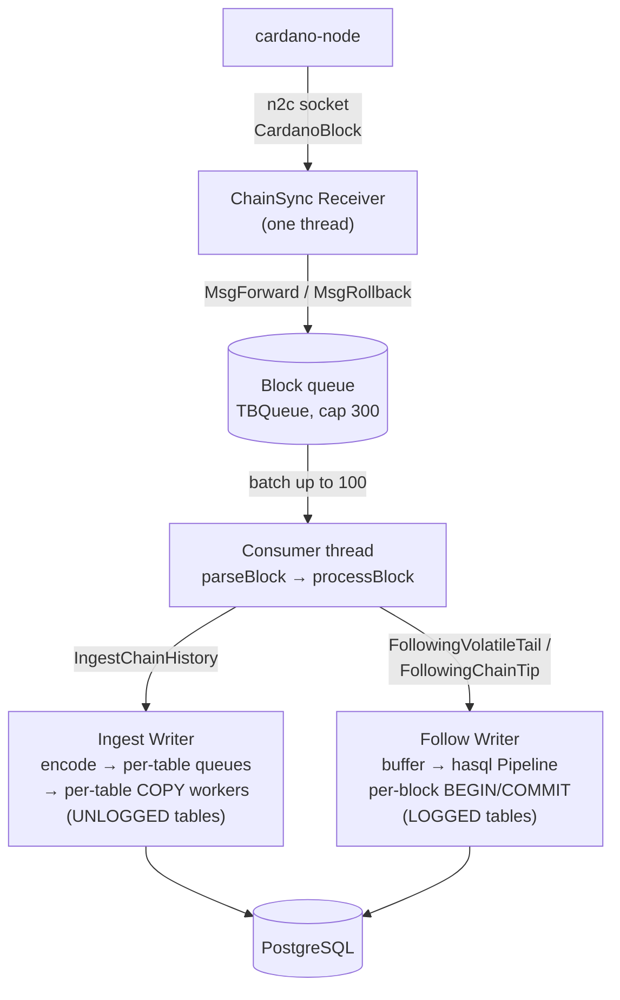

# Developer documentation

dbsync follows a running Cardano node over a node-to-client (n2c) Unix
socket and projects on-chain data into a PostgreSQL schema you control
table by table through the config's `extractors` block.

This section is for contributors working on dbsync itself — writing
extractors, extending the schema, evolving the phase machinery, or
orienting in the codebase. If you only want to **run** dbsync against a
node, head to the [Users section](/users/intro) instead.

## The shape

The hot path has four logical stages: receiver, parser, extractors, and a
phase-specific writer. The writer is what swaps between bulk-load and
chain-tip following. The COPY path drives the catch-up; the hasql path
drives steady state. Both are in play across the lifetime of a sync.

The page that goes deep on this — pre-assigned IDs, the cross-phase
Resolver/Writer interfaces, the side channels (ledger worker, off-chain
fetcher, tx-out worker), boot decisions, threading — is
[Architecture](architecture).

## The lifecycle

dbsync moves through four phases as it catches up to the chain tip and
stays there:

`IngestChainHistory → PreparingForVolatileTail → FollowingVolatileTail → FollowingChainTip`

The last arrow is one-way. Only a `MsgRollback` returns the phase to
`FollowingVolatileTail`, and that path runs a full DELETE cascade.

The pipeline shape above is identical across the run. Only the writer
changes between phases, along with how row ids are obtained.
[Sync phases](phases/overview) covers the state machine and the
transitions.

## Where to read next

- **[Architecture](architecture)** — full data flow, the cross-phase
  interfaces, boot, threading.
- **[Repository layout](repository-layout)** — annotated module map of the
  workspace.
- **[Sync phases](phases/overview)** — the four-phase state machine.
- **[Extractors](extractors/anatomy)** — how extractors work and how to
  add one.
- **[Schema layer](schema-layer)** — DDL generation, COPY encoders, hasql
  statements.
- **[Workers](workers)** — work that runs alongside the main pipeline.
- **[Error handling](error-handling)** — how errors are thrown, propagated,
  and rendered, and the rules that keep a crash log diagnosable.
- **[Comparing databases](db-compare)** — verify this dbsync stores the same
  data as the original cardano-db-sync.
- **[Contributing](contributing)** — workflow and code conventions.
