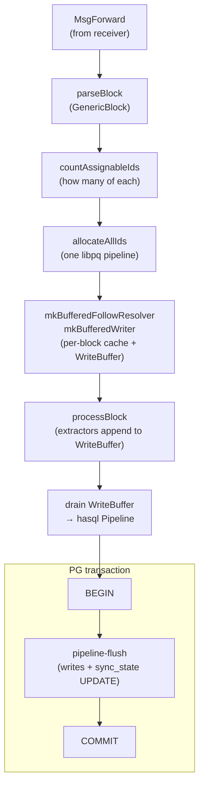

# FollowingVolatileTail

Steady-state phase. Per-block transactional updates over one hasql
connection. The loop in
[`DbSync.Phase.Following.Run`](https://github.com/input-output-hk/dbsync/blob/main/dbsync/src/DbSync/Phase/Following/Run.hs)
drives both this phase and [`FollowingChainTip`](following-chain-tip) —
they share code; only the phase tag flips depending on whether the
consumer is at the receiver's tip.

## The per-block envelope

Each `MsgForward` lands a forward block in its own PG transaction. The
transaction also advances `dbsync_sync_state.last_committed_slot`, so a
crash anywhere in the block rolls back to a clean per-block boundary.

## ID strategy

In Follow, IDs come from PostgreSQL. The naive approach — one `nextval`
per row, one `INSERT … RETURNING` per write — is round-trip-dominated
even with hasql pipelining.

Instead, the loop:

1. **Counts** how many of each ID kind the block will need from the
   parsed `GenericBlock` (`countAssignableIds`).
2. **Bulk-allocates** them in a single libpq pipeline against the
   sequences (`allocateAllIds` in
   [`DbSync.Phase.Following.IdAllocator`](https://github.com/input-output-hk/dbsync/blob/main/dbsync/src/DbSync/Phase/Following/IdAllocator.hs)).
3. Hands the pre-allocated batches to a **buffered resolver** that
   dispenses them as extractors call for IDs.

Dedup tables still hit PG synchronously (one `SELECT` per natural key, a
possible `nextval` on miss), but the buffered resolver consults a
per-block cache so siblings within the block find each other without
re-querying.

## Buffered writes

Every extractor `INSERT` lands on
[`DbSync.Phase.Following.WriteBuffer`](https://github.com/input-output-hk/dbsync/blob/main/dbsync/src/DbSync/Phase/Following/WriteBuffer.hs)
rather than going to PG immediately. At end-of-block, `drain` flushes the
buffer as a single hasql `Pipeline` round-trip alongside the
`sync_state.last_committed_slot` advance.

One pipeline per block trades latency for throughput: chainsync's nominal
~20 s/block on mainnet leaves plenty of room, and batching keeps the
per-block round-trip count constant regardless of how many rows the
block produces.

## Rollback

A `MsgRollback` runs the cascade in
[`DbSync.Phase.Following.Rollback`](https://github.com/input-output-hk/dbsync/blob/main/dbsync/src/DbSync/Phase/Following/Rollback.hs):
DELETE rows past the target slot in FK-dependency order, then update
`sync_state` to the target. The whole cascade runs in a single
transaction so a crash leaves the database at a consistent point.

The receiver only forwards rollback markers; the consumer is the only
writer. There's no cross-thread rollback coordination — Follow is
single-threaded by design, which is what makes rollback under volatile-
block churn straightforward.

## Replay window

A Follow restart from an on-disk ledger snapshot that lags PG has a
"replay window": blocks the ledger worker needs to re-apply but that
are already in PG. The consumer detects the window via
`feReplayBootSlot` and skips its PG-write path for any block at or
below that slot, letting the ledger worker catch up through the
receiver's fan-out without duplicating PG rows.

The window closes on the first block past `feReplayBootSlot`; the
consumer resumes normal per-block transactions from there.
