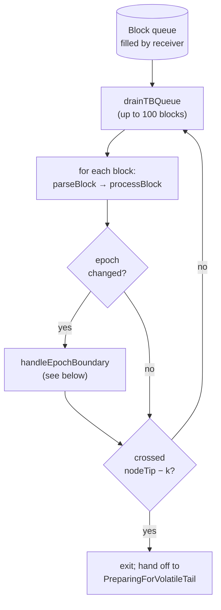

# IngestChainHistory

The bulk-load phase. Drains immutable chain history into UNLOGGED PostgreSQL
tables via parallel COPY streams (one libpq connection per table) and exits
once it reaches the **rollback boundary** at `nodeTip − k`.

The driver is [`DbSync.Phase.Ingest.Consumer`](https://github.com/input-output-hk/dbsync/blob/main/dbsync/src/DbSync/Phase/Ingest/Consumer.hs);
the epoch-boundary cascade lives in
[`DbSync.Phase.Ingest.Boundary`](https://github.com/input-output-hk/dbsync/blob/main/dbsync/src/DbSync/Phase/Ingest/Boundary.hs).

## The consumer loop

The consumer is a single thread that drains the receiver's block queue in
**batches of up to 100**, runs each block through `processBlock`, and tracks
epoch transitions. Per-block work (parsing, extractors, LSM lookups)
dominates by orders of magnitude over per-batch overhead, so the exact
ceiling has little effect on throughput.

:::note `MsgRollback` is unreachable here
The receiver only enqueues rollback markers above `nodeTip − k`, and
the Ingest consumer exits before reaching that point. If one slips
through, the consumer panics rather than silently corrupting the
bulk-loaded data.
:::

## ID strategy

COPY has no return channel for generated IDs. The Ingest resolver covers
that gap with two cooperating pieces:

- **Counter** ([`DbSync.Phase.Ingest.Counter`](https://github.com/input-output-hk/dbsync/blob/main/dbsync/src/DbSync/Phase/Ingest/Counter.hs)) —
  per-table monotonic counters that hand out fresh IDs in-process.
- **DedupStore** ([`DbSync.Phase.Ingest.DedupStore`](https://github.com/input-output-hk/dbsync/blob/main/dbsync/src/DbSync/Phase/Ingest/DedupStore.hs)) —
  five LSM-tree tables mapping each dedup-eligible natural key (stake
  credential hash, multi-asset id, pool key hash, slot leader hash,
  cost-model hash) to the ID assigned the first time we saw it.

For each block, `processBlock` (in `DbSync.Extractor.Pipeline`) pre-assigns
the shared IDs — `BlockId`, `SlotLeaderId`, per-tx `TxId`, per-output
`TxOutId` — *before* any extractor runs. Extractors then consume the
pre-assigned IDs, so they're textually independent.

## LSM-backed scratch state

The DedupStore and the UTxO store (below) sit on a shared `LsmSession`
([`DbSync.Phase.Ingest.LsmSession`](https://github.com/input-output-hk/dbsync/blob/main/dbsync/src/DbSync/Phase/Ingest/LsmSession.hs)),
using the same [`lsm-tree`](https://hackage.haskell.org/package/lsm-tree)
library the Cardano LedgerDB uses for its on-disk UTxO. The choice is
deliberate: both are write-dominated key-value stores with bursty hot-path
traffic and periodic compaction at epoch boundaries.

The session is laid out under `<state-dir>/dbsync-ledger/ingest-lsm/` and
is wiped at the Ingest → Prep handoff — Follow doesn't consult it.

:::info Why rebuild dedup from PG, not LSM
A restart in Ingest re-opens the existing session, but the dedup
tables are rebuilt from PG on `BootResume` rather than from the
LSM tables. The LSM data may be ahead of `last_committed_slot` (the
LSM session compacts at every epoch boundary, but writes happen
continuously); PG is the truth source.
:::

See [Architecture › Storage backends](../architecture#storage-backends)
for the broader picture of LSM vs PG roles.

## Inline UTxO resolution

The UTxO extractor needs `tx_in.tx_out_id` for every input it writes. In
Follow, that's a SQL lookup against the existing `tx_out` row. In Ingest,
the row may not be in PG yet — COPY workers are still draining the queue.

The fix is an LSM-backed in-process cache:
[`Phase.Ingest.UtxoStore`](https://github.com/input-output-hk/dbsync/blob/main/dbsync/src/DbSync/Phase/Ingest/UtxoStore.hs)
maps `tx-hash → (TxId, [(TxOutId, value)])` and is populated as each tx's
outputs are pre-assigned. A later tx in the same block spending an earlier
tx's output resolves through the cache; misses fall through to a post-load
**resolve pass** in `PreparingForVolatileTail`.

Consumed outputs are deleted from the cache so it tracks the **live UTxO
set**, not chain history. On mainnet this caps the LSM table at the
current UTxO size rather than total tx-output count.

## Epoch boundaries

The consumer detects an epoch transition by comparing `sdEpochNo` between
adjacent blocks. On a cross, control passes to `handleEpochBoundary`, which
runs a **pipelined cascade**:

1. Flush the loader stream — commit every per-table COPY in flight.
2. Snapshot the per-epoch buffers (address buffer, consumed-by buffer) and
   hand them to the tx-out worker as a job.
3. Await the tx-out worker (it's draining the *previous* epoch's job — see
   below).
4. Advance `dbsync_sync_state` for the previous pending epoch.
5. Enqueue the just-finished epoch as the new pending one.
6. Reopen the loader stream for the next epoch.
7. Compact the LSM tables (dedup + UTxO).
8. Emit the per-epoch summary log line.

The **one-epoch lag** is deliberate. `sync_state` always reflects the last
epoch the tx-out worker has fully resolved, so a crash mid-epoch can be
cleanly cleaned up with `deleteRowsPastSlot` on resume. The pipelining
means the consumer doesn't wait for the worker on the hot path — it only
blocks on the *previous* epoch's drain at the next boundary, by which time
the worker has almost always finished.

## Exit: the rollback boundary

Cardano's protocol security parameter `k` (2160 on mainnet) is the maximum
rollback depth. Below `nodeTip − k` the chain is immune to rollback;
above it any block could be reverted. The Ingest consumer exits cleanly
when it observes a block whose slot crosses that boundary, because
above the boundary we need the per-block transactional path that
[`FollowingVolatileTail`](following-volatile-tail) provides.

The receiver publishes the rollback boundary as a `TVar (Maybe BlockNo)`
that it updates on every observed tip. The consumer's per-block exit
check is one `readTVarIO` and a comparison — cheap on the hot path.

Once the consumer exits, the orchestrator cancels the receiver, releases
the loader stream + tx-out worker + dedup stores + UTxO store, and runs
[`PreparingForVolatileTail`](preparing) before flipping to Follow.

## Crash recovery

`IngestChainHistory` can resume from any committed epoch boundary. The
boot decision (`BootResume`) reads the sync-state row, rebuilds the dedup
maps from PG, populates the cost-model cache, and (when ledger is on)
loads the chosen on-disk snapshot.

Any rows past `last_committed_slot` are deleted by `deleteRowsPastSlot`
during boot. UNLOGGED tables are zero-cost to clean up since they're not
WAL-logged anyway.
