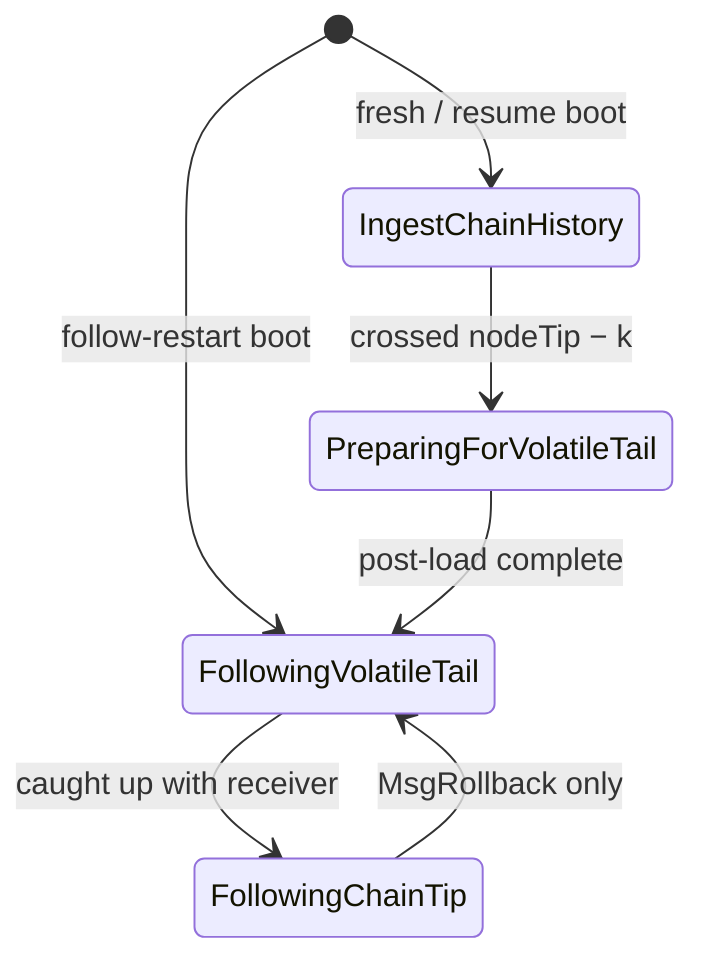

# Sync phases

dbsync moves through four phases as it catches up to the chain tip and stays
there:



The enum lives in [`DbSync.Phase.Type`](https://github.com/input-output-hk/dbsync/blob/main/dbsync/src/DbSync/Phase/Type.hs):

```haskell
data SyncPhase
  = IngestChainHistory
  | PreparingForVolatileTail
  | FollowingVolatileTail
  | FollowingChainTip
```

The live value is held in a `TVar` wrapped by `CurrentPhase` (see
[`DbSync.Phase.Current`](https://github.com/input-output-hk/dbsync/blob/main/dbsync/src/DbSync/Phase/Current.hs)).
The orchestrator and the Follow loop are the only writers. Everyone else
reads: extractors, log prefixes, and the `epoch_sync_stats.phase` column.

## Why four?

The pipeline shape is identical across the run — receiver → consumer →
extractors → writer. What changes between phases is:

- **The writer.** Ingest uses parallel COPY streams (one per table) into
  UNLOGGED tables. Follow uses one hasql connection with per-block
  `BEGIN`/`COMMIT`.
- **The ID strategy.** Ingest pre-assigns IDs from a counter and a dedup
  map. Follow bulk-allocates them from PostgreSQL with one
  `SELECT nextval(seq) FROM generate_series(1, N)` per table.
- **Whether the work is on the critical path.** Ledger-derived state, FK
  backfills, and indexes are batched into the post-load Prep phase rather
  than slowing down the bulk-load.

Four states (rather than three) lets the log distinguish two operational
states that share code: `FollowingVolatileTail` (the consumer is still
catching up with the receiver, e.g. just after a restart) versus
`FollowingChainTip` (consumer is at the receiver's tip and idling between
blocks).

## Phase responsibilities

### `IngestChainHistory`

Bulk-load the immutable chain history. Writes through parallel COPY streams
(one per table) into UNLOGGED tables. Pre-assigned IDs come from an
LSM-backed dedup store and per-table counters. Epoch-aligned commits.

:::info The rollback boundary
Ingest exits when an applied block's **block number** reaches
`nodeTip − k`, where `k` is the protocol security parameter (2160 on
mainnet). The comparison is on block numbers, not slots.

Below the boundary the chain cannot roll back. Above it any block could
be reverted, so dbsync needs the per-block transactional path that
Follow provides.
:::

See [IngestChainHistory](ingest) for the detailed walk-through.

### `PreparingForVolatileTail`

One-time post-load pass. Runs once Ingest exits. Single hasql connection;
a parallel pool for the heavy work.

What it does, in order:

1. **Session GUCs** — `maintenance_work_mem`,
   `max_parallel_maintenance_workers`, `synchronous_commit`, applied once
   so every later index build and `ANALYZE` picks them up.
2. **Pre-resolve indexes** — scaffolding indexes on the still-UNLOGGED
   tables so the resolves and backfills use index lookups rather than
   hash-joining heap to heap.
3. **Resolve FKs** — `tx_in.tx_out_id`, `collateral_tx_in.tx_out_id`,
   `reference_tx_in.tx_out_id`, left NULL during Ingest because the
   producer rows had not been written at COPY time. The residual
   `tx_out.consumed_by_tx_id` UPDATE runs here too.
4. **Post-resolve indexes** — rebuild the input-table indexes the CTAS
   rebuilds dropped.
5. **Backfill** — the `tx` columns the body alone cannot supply (phase-2
   fee, phase-2 deposit, ledger-disabled valid-contract deposit), plus
   `redeemer.script_hash` for spend redeemers, plus the pending deposits
   from `epoch_param_pending`.
6. **Drop scaffolding indexes** — `ALTER TABLE … SET LOGGED` rebuilds every
   index on the table inside the ALTER, so any index alive at flip time is
   paid for twice. Bare heaps flip fastest.
7. **Schema-mode flip** — `ALTER TABLE … SET LOGGED` per table, fanned out
   across a pool. The flip rewrites the heap. With `wal_level = minimal`,
   PostgreSQL skips writing that rewrite to the WAL.
8. **Production index build** — the full index set, built exactly once,
   fanned out per index across the pool.
9. **ANALYZE** — accurate planner statistics for every table.
10. **Ownership foreign keys** — add each `tdParentRefs` edge as
    `NOT VALID`, then validate them across the pool.
11. **Sequence reset** — advance every sequence past the Ingest-assigned
    ids before Follow issues its first query.

Step ordering matters — see [PreparingForVolatileTail](preparing) for the
constraints between steps and the timing characteristics.

### `FollowingVolatileTail`

The Follow loop, with the consumer still draining the block queue. Per-block
`BEGIN`/`COMMIT` over a single hasql connection. Writes batched into a hasql
`Pipeline` flushed once per block. `dbsync_sync_state.last_committed_slot` advances
inside the same transaction so a crash leaves the database at a clean
per-block boundary.

The phase tag is just for logs and the `epoch_sync_stats.phase` column. The
code is identical to `FollowingChainTip`.

### `FollowingChainTip`

Same code as `FollowingVolatileTail`, different label. The consumer has
caught up with the receiver and idles between blocks. On mainnet a block
arrives roughly every 20 seconds, so there is a real gap between writes
here.

Two cosmetic differences:

- The Follow loop emits a `"still at tip"` idle heartbeat every 30 s when
  no block has arrived.
- The per-block progress log is more verbose (per-block delta + slot info)
  because there's no throughput-style summary to fall back on.

The `FollowingVolatileTail → FollowingChainTip` flip is automatic: after
each block the Follow loop compares the applied block number against the
receiver's tip. That direction is a log distinction only.

**The reverse is not automatic.** Only `MsgRollback` returns the phase to
`FollowingVolatileTail`, and that path runs the full DELETE cascade. See
[FollowingChainTip](following-chain-tip#the-flip-is-one-way).

## Transitions

Triggered by, in order of run-time occurrence:

| From | To | Trigger | Side effects |
|---|---|---|---|
| (boot) | `IngestChainHistory` | Fresh DB, or resume with `sync_complete = false`. | Open LSM, build dedup stores, start receiver + COPY workers. |
| (boot) | `FollowingVolatileTail` | Resume with `sync_complete = true` (a previous run finished Ingest+Prep). | Close LSM (Follow doesn't use it), open hasql Follow connection. |
| `IngestChainHistory` | `PreparingForVolatileTail` | Consumer observes a block at or past `nodeTip − k`. | Cancel receiver. Close loader stream, tx-out worker, UTxO store, dedup stores. Open Prep hasql connection. |
| `PreparingForVolatileTail` | `FollowingVolatileTail` | Post-load pass completes. | Mark `sync_complete = true` in the sync-state row. Delete the ingest LSM scratch directory. Open Follow hasql connection. Start a fresh receiver from the post-Ingest position. |
| `FollowingVolatileTail` | `FollowingChainTip` | Applied block number reaches the receiver's tip. | None (label only). |
| `FollowingChainTip` | `FollowingVolatileTail` | `MsgRollback`. Nothing else. | The full rollback DELETE cascade, in one transaction. |

The first three transitions involve real resource handoff and live in
`DbSync.App.Run.runIngestThenFollow`. The last two happen on the consumer's
hot path inside [`DbSync.Phase.Following.Run`](https://github.com/input-output-hk/dbsync/blob/main/dbsync/src/DbSync/Phase/Following/Run.hs).

## What survives a transition

These structures are created once and re-used:

- **`CoreEnv`** — config, tracer, metrics, network ID, current-phase ref,
  security param, the extractor list.
- **Ledger worker + snapshot writer asyncs** — when ledger is enabled, they
  stay alive across the entire Ingest → Prep → Follow span. Their
  LSM-backed `LedgerDB` keeps ticking through Prep even though Prep itself
  doesn't touch it.
- **The receiver-side state** — the block queue, the state-query var, the
  latest point, the rollback boundary, and the latest tip block. On the
  in-process Ingest → Follow handoff, `mkFollowEnvFromIngest` carries these
  over so the Follow consumer sees any blocks the Ingest receiver queued
  past the rollback boundary before it was cancelled.

These are released at the Ingest → Prep boundary:

- The COPY loader stream (one libpq connection per table).
- The tx-out worker and its buffers.
- The Ingest LSM **tables**.

The Ingest LSM **session** is not. `closeAndDeleteLsmSession` runs only
after Prep completes, because the session is Prep's restart anchor.

## Cold restarts

A cold boot routes into one of the three phase paths based on what's in PG
and on disk; see [Architecture › Boot](../architecture#boot) for the
classification and the recovery handling.
