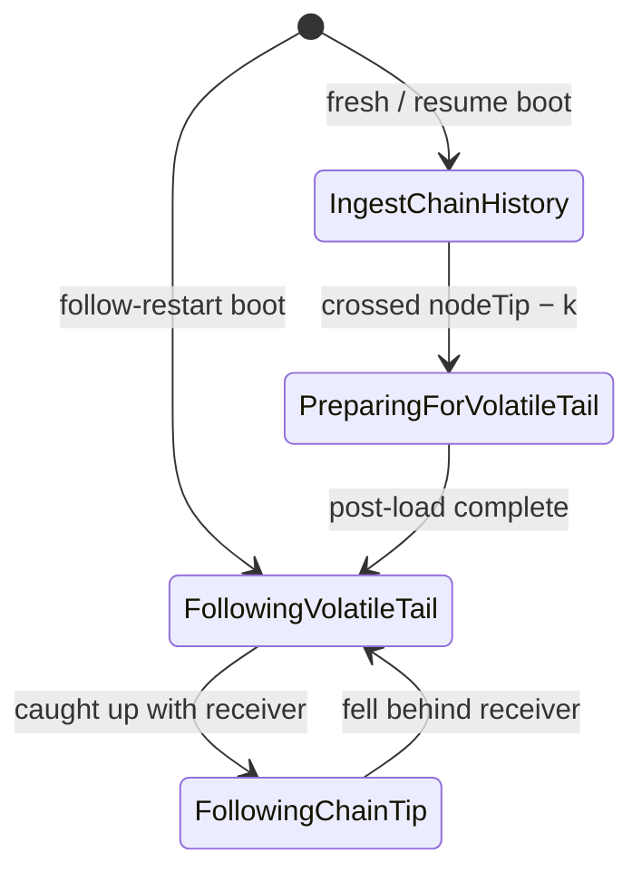

# Sync phases

dbsync moves through four phases as it catches up to the chain tip and stays
there:



The enum lives in [`DbSync.Phase.Type`](https://github.com/input-output-hk/dbsync/blob/main/dbsync/src/DbSync/Phase/Type.hs):

```haskell
data SyncPhase
  = IngestChainHistory
  | PreparingForVolatileTail
  | FollowingVolatileTail
  | FollowingChainTip
```

The live value is held in a `TVar` wrapped by `CurrentPhase` (see
[`DbSync.Phase.Current`](https://github.com/input-output-hk/dbsync/blob/main/dbsync/src/DbSync/Phase/Current.hs)).
The orchestrator and the Follow loop are the only writers; everyone else reads
(extractors, log prefixes, the watchdog, the `epoch_sync_stats.phase` column).

## Why four?

The pipeline shape is identical across the run — receiver → consumer →
extractors → writer. What changes between phases is:

- **The writer.** Ingest uses parallel COPY streams (one per table) into
  UNLOGGED tables. Follow uses one hasql connection with per-block
  `BEGIN`/`COMMIT`.
- **The ID strategy.** Ingest pre-assigns IDs from a counter + dedup map.
  Follow gets IDs from PostgreSQL via `nextval` and `INSERT … RETURNING`.
- **Whether the work is on the critical path.** Ledger-derived state, FK
  backfills, and indexes are batched into the post-load Prep phase rather
  than slowing down the bulk-load.

Four states (rather than three) lets the log distinguish two operational
states that share code: `FollowingVolatileTail` (the consumer is still
catching up with the receiver, e.g. just after a restart) versus
`FollowingChainTip` (consumer is at the receiver's tip and idling between
blocks).

## Phase responsibilities

### `IngestChainHistory`

Bulk-load the immutable chain history. Writes through parallel COPY streams
(one per table) into UNLOGGED tables. Pre-assigned IDs come from an
LSM-backed dedup store and per-table counters. Epoch-aligned commits.

:::info The rollback boundary
Exits when a block's slot crosses `nodeTip − k`, where `k` is the
protocol security parameter (2160 on mainnet). Below the boundary
the chain is immune to rollback; above it any block could be
reverted, so we need the per-block transactional path Follow
provides.
:::

See [IngestChainHistory](ingest) for the detailed walk-through.

### `PreparingForVolatileTail`

One-time post-load pass. Runs once Ingest exits. Single hasql connection;
a parallel pool for the heavy work.

What it does, in order:

1. **Pre-resolve indexes** — scaffolding indexes on the still-UNLOGGED
   tables so the resolve and backfill UPDATEs use index lookups rather
   than hash-joining heap-to-heap.
2. **Resolve FKs** — `tx_in.tx_out_id`, `collateral_tx_in.tx_out_id`,
   `reference_tx_in.tx_out_id`. These were left NULL during Ingest because
   the producer rows hadn't been written yet at COPY time.
3. **Backfill** — three `tx` columns the body alone can't supply (phase-2
   fee, phase-2 deposit, ledger-disabled valid-contract deposit), plus the
   `tx_out.consumed_by_tx_id` column if it's enabled.
4. **Drop scaffolding indexes** — `ALTER TABLE … SET LOGGED` rebuilds every
   index on the table inside the ALTER, so any index alive at flip time is
   paid for twice. Bare heaps flip fastest.
5. **Schema-mode flip + sequence attach** — `ALTER TABLE … SET LOGGED` per
   table, fanned out across a pool. The flip rewrites the heap; on a
   profile where `wal_level = minimal` PostgreSQL skips writing the
   rewrite to WAL.
6. **Index build** — the full production index set, built exactly once,
   fanned out per index across the pool.
7. **ANALYZE + sequence setval** — give the query planner accurate stats
   and advance the sequences past the Ingest-assigned IDs before Follow
   starts running queries.

Step ordering matters — see [PreparingForVolatileTail](preparing) for the
constraints between steps and the timing characteristics.

### `FollowingVolatileTail`

The Follow loop, with the consumer still draining the block queue. Per-block
`BEGIN`/`COMMIT` over a single hasql connection. Writes batched into a hasql
`Pipeline` flushed once per block. `sync_state.last_committed_slot` advances
inside the same transaction so a crash leaves the database at a clean
per-block boundary.

The phase tag is just for logs and the `epoch_sync_stats.phase` column. The
code is identical to `FollowingChainTip`.

### `FollowingChainTip`

Same code as `FollowingVolatileTail`, different label. The consumer has
caught up with the receiver and is idling between blocks. Mainnet's nominal
20-second slot time means there's a real gap between writes here.

Two cosmetic differences:

- The Follow loop emits a `"still at tip"` idle heartbeat every 30 s when
  no block has arrived.
- The per-block progress log is more verbose (per-block delta + slot info)
  because there's no throughput-style summary to fall back on.

The transition between the two is automatic: the Follow loop checks every
block whether the consumer is at the receiver's tip and flips the phase
accordingly. The boundary between them is not a "real" lifecycle event for
PG — only a log distinction.

## Transitions

Triggered by, in order of run-time occurrence:

| From | To | Trigger | Side effects |
|---|---|---|---|
| (boot) | `IngestChainHistory` | Fresh DB, or resume with `sync_complete = false`. | Open LSM, build dedup stores, start receiver + COPY workers. |
| (boot) | `FollowingVolatileTail` | Resume with `sync_complete = true` (a previous run finished Ingest+Prep). | Close LSM (Follow doesn't use it), open hasql Follow connection. |
| `IngestChainHistory` | `PreparingForVolatileTail` | Consumer observes a block at or past `nodeTip − k`. | Cancel receiver. Close loader stream, tx-out worker, UTxO store, dedup stores. Open Prep hasql connection. |
| `PreparingForVolatileTail` | `FollowingVolatileTail` | Post-load pass completes. | Mark `sync_complete = true` in the sync-state row. Delete the ingest LSM scratch directory. Open Follow hasql connection. Start a fresh receiver from the post-Ingest position. |
| `FollowingVolatileTail` | `FollowingChainTip` | Follow loop's per-block check sees consumer at receiver's tip. | None (label only). |
| `FollowingChainTip` | `FollowingVolatileTail` | Follow loop sees the consumer fell behind the receiver. | None (label only). |

The first three transitions involve real resource handoff and live in
`DbSync.App.Run.runIngestThenFollow`. The last two flip on the consumer's
hot path inside [`DbSync.Phase.Following.Run`](https://github.com/input-output-hk/dbsync/blob/main/dbsync/src/DbSync/Phase/Following/Run.hs).

## What survives a transition

These structures are created once and re-used:

- **`CoreEnv`** — config, tracer, metrics, network ID, current-phase ref,
  security param, the extractor list.
- **Ledger worker + snapshot writer asyncs** — when ledger is enabled, they
  stay alive across the entire Ingest → Prep → Follow span. Their
  LSM-backed `LedgerDB` keeps ticking through Prep even though Prep itself
  doesn't touch it.
- **The receiver-side state** (block queue, watchdog, latest-point ref) — on
  the in-process Ingest → Follow handoff, `mkFollowEnvFromIngest` carries
  these over so the Follow consumer sees any blocks the Ingest receiver
  queued past the rollback boundary before being cancelled.

These are released at the Ingest → Prep boundary:

- The COPY loader stream (one libpq connection per table).
- The tx-out worker and its buffers.
- The Ingest LSM session (dedup stores + UTxO store).

## Cold restarts

A cold boot routes into one of the three phase paths based on what's in PG
and on disk; see [Architecture › Boot](../architecture#boot) for the
classification and the recovery handling.
