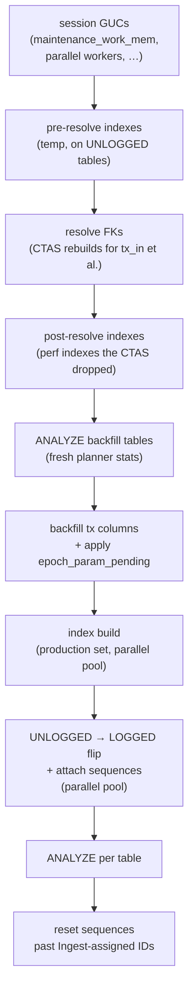

# PreparingForVolatileTail

One-time post-load pass between Ingest and Follow. Runs on a single hasql
connection plus a parallel pool for the heavy work.

The driver is [`DbSync.Phase.Preparing.Run`](https://github.com/input-output-hk/dbsync/blob/main/dbsync/src/DbSync/Phase/Preparing/Run.hs).

## What needs fixing

Ingest's COPY pipeline leaves three things in a transitional state:

- **FK columns** on `tx_in`, `collateral_tx_in`, `reference_tx_in`, and
  optionally `tx_out.consumed_by_tx_id` are NULL or unresolved. COPY can't
  fill them because the producer rows weren't necessarily in PG yet at the
  time the consumer rows were written.
- **A few `tx` columns** — phase-2 fee, phase-2 deposit, the
  ledger-disabled valid-contract deposit — can't be filled from the tx body
  alone. The parser leaves a sentinel or NULL.
- **Tables are UNLOGGED**, have no sequences attached, and have no
  production indexes. The COPY pipeline ran flat-out without them.

The Preparing pass walks all of that.

## The sequence

:::warning Step ordering matters
Pre-resolve indexes must precede the FK rebuild — otherwise the
CTAS's join-on-hash UPDATEs hash-join heap-to-heap. Sequence reset
must follow the schema-mode flip — the sequence has to exist before
`setval` can advance it. Resist the urge to reorder.
:::

Operators that need to see step timings raise their profile's
`logging.level` to `debug`; the production default emits only the
outer "started" and "complete" markers.

## CTAS rebuild

For `tx_in`, `collateral_tx_in`, and `reference_tx_in`, the FK resolution
is a `CREATE TABLE AS … SELECT` against the joined `tx` table rather than
an `UPDATE` of the existing rows. The rebuild is faster for full-table
fixes on UNLOGGED data, and it drops the input-table's old perf indexes
along the way — which is why the **post-resolve indexes** step comes
straight after, before the backfill UPDATEs that need them.

## UNLOGGED → LOGGED

Tables run UNLOGGED during Ingest so PostgreSQL skips WAL for every row
written. The price is that UNLOGGED tables don't survive a crash. The
flip rewrites each table's heap into the regular logged form:

- On profiles with `wal_level = minimal`, the rewrite itself isn't
  WAL-logged either — the whole transition is essentially free I/O-wise.
- On `wal_level = replica` (the default), the rewrite *is* WAL-logged.
  Operators get a warning at boot recommending the minimal setting for
  the duration of an initial sync.

:::tip Operational lever
The single biggest knob on Prep wall-clock time is the server's
`wal_level`. For one-time initial syncs against a non-replicated PG,
flipping to `minimal` for the duration of the sync gives a 20–30%
reduction. See `scripts/postgres-tuning.conf` in the repo.
:::

The flip runs concurrently across tables on a parallel pool because
each table's rewrite is independent.

## Why ANALYZE twice

The first `ANALYZE` runs immediately after the CTAS rebuild: the planner
needs fresh statistics on the rebuilt input tables before the backfill
`UPDATE`s plan their joins. Autovacuum *will* eventually update stats on
UNLOGGED tables, but its last sample was taken mid-Ingest against tables
that no longer exist in their original form. Without the pass, the
backfills pick Nested Loop plans whose outer-side cardinality is off by
orders of magnitude.

The second `ANALYZE` (per table, after the schema flip) gives Follow's
query planner accurate stats before the first per-block transaction
arrives.

## Timing characteristics

Preparing is bounded by I/O on the index build and the CTAS rebuilds.
Throughput scales with `max_parallel_maintenance_workers`,
`maintenance_work_mem`, and the number of cores in the parallel pool.

For a mainnet `everything-profile` sync the pass typically completes in
a few minutes. Most of the time goes to the production index build and
the `UNLOGGED → LOGGED` flip (both proportional to total row count).
