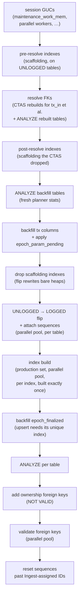

# PreparingForVolatileTail

One-time post-load pass between Ingest and Follow. Runs on a single hasql
connection plus a parallel pool for the heavy work.

The driver is [`DbSync.Phase.Preparing.Run`](https://github.com/input-output-hk/dbsync/blob/main/dbsync/src/DbSync/Phase/Preparing/Run.hs).

## What needs fixing

Ingest's COPY pipeline leaves three things in a transitional state:

- **FK columns** on `tx_in`, `collateral_tx_in`, `reference_tx_in`, and
  optionally `tx_out.consumed_by_tx_id` are NULL or unresolved. COPY cannot
  fill them, because the producer rows were not necessarily in PG when the
  consumer rows were written.
- **Columns the tx body cannot supply** — the phase-2 fee, the phase-2
  deposit, the ledger-disabled valid-contract deposit, and
  `redeemer.script_hash` for spend redeemers. The parser leaves a sentinel
  or NULL.
- **Tables are UNLOGGED**, carry no sequences, no production indexes, and
  no ownership foreign keys. The COPY pipeline ran flat-out without them.

The Preparing pass walks all of that.

## The sequence



The `Backfill` node covers four statements: the `tx` column backfills,
`rebuildSpendScriptHash`, `applyDepositPending`, and the
`epoch_param_pending` truncate.

:::warning Step ordering matters
Pre-resolve indexes must precede the FK rebuild — otherwise the
resolve and backfill UPDATEs hash-join heap-to-heap. Every index must
be dropped before the schema-mode flip — `ALTER TABLE … SET LOGGED`
rewrites the heap *and rebuilds every index on the table inside the
ALTER*, so an index alive at flip time is built twice. The
`epoch_finalized` backfill must follow the index build — its
`ON CONFLICT ("no")` upsert needs the unique index. Sequence reset
must follow the flip — the sequence has to exist before `setval` can
advance it. Foreign keys go on last, after the data is final, so
validation scans clean tables once. Resist the urge to reorder.
:::

:::note No enclosing transaction
Prep has no outer `BEGIN`/`COMMIT`. Each step runs in its own implicit
transaction, which is what lets a crash resume at a step boundary instead
of replaying the whole pass.
:::

Every step is bracketed by a uniform log pair at the default `info`
level, so a slow pass shows exactly which step is in flight:

```
Starting  | resolve  | tx_in.tx_out_id (table rebuild)
Completed | resolve  | tx_in.tx_out_id (table rebuild) | 12m 34s | ✓
Starting  | backfill | tx.fee (Byron txs)
Completed | backfill | tx.fee (Byron txs) | 45.67s | ✓ | 1,234,567 rows
```

A step that throws emits `Failed | … | ✗` with the elapsed time and
rethrows. The parallel flip and index-build steps additionally log one
pair per table / per index inside the outer step's pair.

## CTAS rebuild

For `tx_in`, `collateral_tx_in`, and `reference_tx_in`, the FK resolution
rebuilds the table from a `SELECT` joined against `tx` rather than
`UPDATE`-ing the existing rows. The rebuild is faster for full-table
fixes on UNLOGGED data, and it drops the input-table's old scaffolding
indexes along the way — which is why the **post-resolve indexes** step
comes straight after, before the backfill UPDATEs that need them. The
rebuild is a true `CREATE TABLE … AS SELECT`: PostgreSQL never
parallelises a query that writes through `INSERT`, but a CTAS `SELECT`
is eligible for a parallel join plan. NOT NULL / default / check /
identity constraints are re-attached from the `TableDef` after the
rename, and the recreated identity sequences are repositioned by the
final sequence-reset step. The rebuilt tables are `ANALYZE`d
immediately so the residual `consumed_by_tx_id` UPDATE doesn't plan
against zero statistics.

## UNLOGGED → LOGGED

Tables run UNLOGGED during Ingest so PostgreSQL skips WAL for every row
written. The price is that UNLOGGED tables don't survive a crash. The
flip rewrites each table's heap into the regular logged form:

- With `wal_level = minimal`, the rewrite itself is not WAL-logged
  either, so the transition costs almost no extra I/O.
- On `wal_level = replica` (the default), the rewrite *is* WAL-logged.
  dbsync warns about this on the run that creates the schema, and
  recommends `minimal` for the duration of an initial sync. It does not
  repeat the warning on later boots.

:::tip Operational lever
The single biggest server-side knob on Prep wall-clock time is
`wal_level`. For one-time initial syncs against a non-replicated PG,
flipping to `minimal` for the duration of the sync avoids WAL-logging
both the heap rewrites and the index builds. See
`scripts/postgres-tuning.conf` in the repo.
:::

The flip runs concurrently across tables on a parallel pool (biggest
tables first, so the long rewrites overlap with the rest) because each
table's rewrite is independent. `SET LOGGED` rebuilds every index on
the table inside the ALTER, which is why the pass flips *bare* heaps:
the scaffolding is dropped beforehand and the production set is built
afterwards, so each production index is built exactly once — with full
`max_parallel_maintenance_workers` support and per-index pool fan-out
instead of serially inside each table's ALTER. A side benefit: the
rewrite compacts the dead tuples the backfill UPDATEs left behind, so
no pre-flip `VACUUM` is needed.

## Why ANALYZE twice

The first `ANALYZE` runs immediately after the CTAS rebuild: the planner
needs fresh statistics on the rebuilt input tables before the backfill
`UPDATE`s plan their joins. Autovacuum *will* eventually update stats on
UNLOGGED tables, but its last sample was taken mid-Ingest against tables
that no longer exist in their original form. Without the pass, the
backfills pick Nested Loop plans whose outer-side cardinality is off by
orders of magnitude.

The second `ANALYZE` (per table, after the schema flip) gives Follow's
query planner accurate stats before the first per-block transaction
arrives.

## Timing characteristics

I/O bounds this pass: the CTAS rebuilds, the flip's heap rewrites, and
the index build. Throughput scales with
`max_parallel_maintenance_workers`, `maintenance_work_mem`, and the pool
size. All three are fixed in `DbSync.Phase.Preparing.Tuning`, sized for
the 4-core / 16 GB target.

Three steps dominate the wall clock, and all three scale with total row
count: the `tx_in` rebuild, the `UNLOGGED → LOGGED` heap rewrites, and
the production index build.

Read the per-step `Starting | Completed` log pairs to see where a given
run spent its time.
